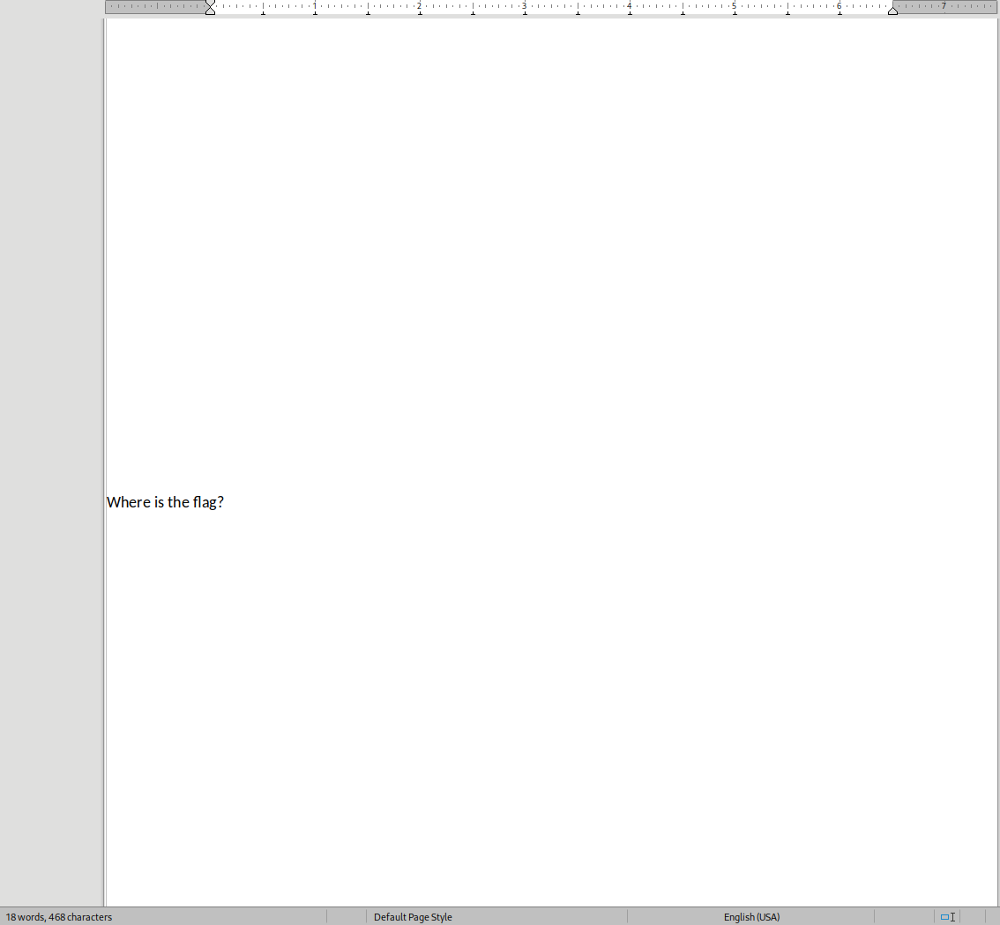
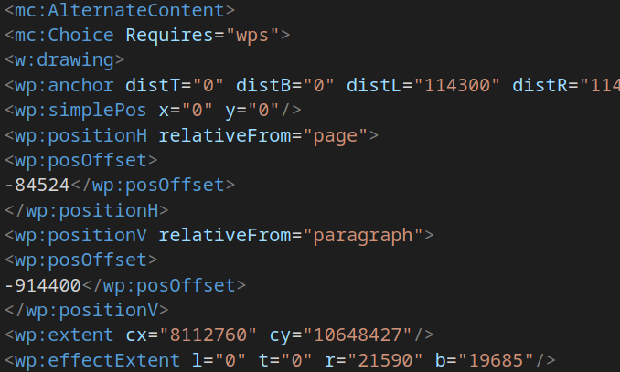

### Investigating Microsoft Word metadata
#### Cybergon CTF forensics Hide and Seek

Editing Word metadata to find hidden content.
<!-- more -->

{}

This will be a shorter writeup than usual, but I think some of the techniques used can be useful in many future challenges. As we know, Word files are equivalent to zip files in that we can unzip them to see their contents (`unzip Secret_file.docx`). After unzipping Secret_file.docx we get have the following structure:


With many large files, the reasonable next step is to open the original docx and see if there is anything interesting there.



Using Ctrl+a to mark all the content and changing the color to black we see the "Where is the flag?" text. However, we can also see that there should be way more words and characters in the bottom left, so there must be some content missing. We can find the "Where is the flag?" text in ./word/document.xml so I decided to look around a bit more in that file. The most interesting thing was the following part:



`-84524</wp:posOffset></wp:positionH>` looks like coordinates in the height direction and `-914400</wp:posOffset></wp:positionV>` looks like coordinates in the width direction. It seems irregular that data should be that far off the page, so this could be interesting. There are other ways to find the data that is being referenced, but the simplest is to change both -84524 and -914400 to 0. We can then rezip it with `zip -r Secret_file.docx *` in the directory with word, _rels etc. Opening up the newly created file, we can see some tiny data in the header. After making it larger, we can read:
```
++++++++++[>+>+++>+++++++>++++++++++<<<<-]>>>---.>+++++++++++++++++++++.-----------------------.+++.+++++++++++++.<++++.>---.-.<----.+++++++++++++++++.--------------.>+++++++++++++.<-----------------.--.>------------------------.-----------------.<.++++.>+++++++++++++.<+++++++++++++.----------------.+++.---.>.<---.>+++++++++++++++.---------------.<+++++++++++++++++++++++.<+++++++++++++++++++++.+.>>+++++.<<-.>++++++++++.>+++++++++++++++++++++++++.
```

This is brainfuck and can be run online (for example at https://www.dcode.fr/brainfuck-language). Running it provides us with the flag which was CyberGonCTF{53cR37_D474_1n_H34d3R}. As the flag suggests, we could also have found the same brainfuck code through the word/header1.xml file we saw previously.


