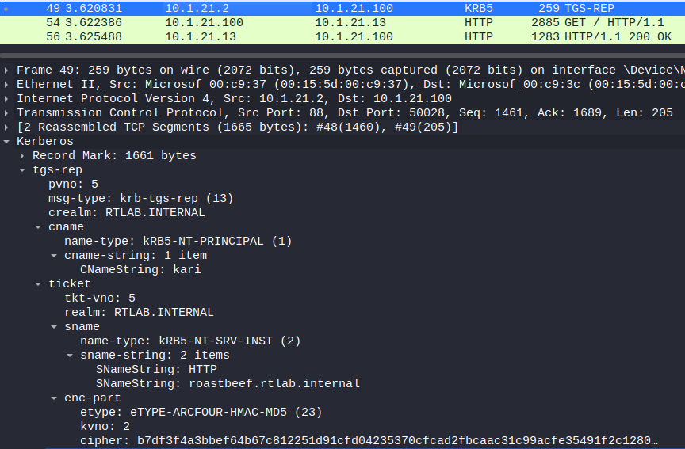
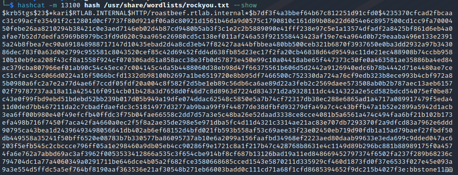

This challenge provided a pcapng capture of a kerberos authentication request, and our task was to crack the password used in this request.
It was one of the two 500 point challenges from the PWC CTF NTNU Trondheim 2023, and noone sloved it during the event.
I solved it after the event with a lot of support and research from https://github.com/felixalbrigtsen.
 <!--more-->

{}

The first thing I always do when opening a capture in wireshark containing http is to download the http objects through File > Export Objects > HTTP. I should probably get used to reviewing the traffic more thoroughly first, however I have gotten a lot of easy point this way so we'll see...

Anyway, looking at the exported http objects there are two http responses containing 401 - Unauthorized and a final response containing a screenshot of a Windows IIS dashboard. This should be a pretty clear hint that the challenge is windows and authentication related.

Looking closer at the capture in wireshark, we see the two 401 - Unauthorized responses, followed by som kerberos traffic (KRB5). Filtering by kerberos we see the following traffic:


I am not very familiar with the kerberos protocol, but I learned that one of the most common attacks against it is Kerberoasting. This combined with the challenge name means that it is the right path. The first part of a kerberoasting attack is to extract a hash from the captured traffic. The second part is to crack that hash and find a password.

To create our hash we need to know what were looking for. According to the hashcat manual there are many different types of hashes:


We can see many different types of hashes. I took a lot of inspiration from https://blog.xpnsec.com/kerberos-attacks-part-1/, and the hash cracked in that guide was a TGS-REP 23, so I will try to use that. We can use the --example-hashes flag combined with the mode in hashcat to see what our hash needs to look like. 


Our hash needs to be in the format `$krb5tgs$<ENCRYPTION_TYPE>$*<USERNAME>$<REALM>$<SPN>*$<FIRST_16_BYTES_TICKET>$<REMAINING_TICKET_BYTES>`. All of this information can be found in the TGS-REP in wireshark.



Here we can see the enxryption type 23 (at the end of the etype line), the username kari, the realm RTLAB.INTERNAL, the spn HTTP/roastbeef.rtlab.internal (from the sname-strings) and finally the ticket bytes (cipher) at the end. Putting it all together, and remembering to insert a dollar sign after 16 bytes (32 hex characters), our hash becomes this:

```
$krb5tgs$23$*kari$RTLAB.INTERNAL$HTTP/roastbeef.rtlab.internal*$b7df3f4a3bbef64b67c812251d91cfd0$4235370cfcad2fbcaac31c99acfe35491f2c12801d0cf7737f80d921ef06a8c80921d1561b46da9d0575c1790810c161d89b08e22d6054e6c8957500cd1cc9fa7000450febe26aa8210294b38421c0e3aed7146eb02d4b87cd9480b5ab3f3c1e2c2b5889090e41fff238e97c5e1a13574dfadf2a8425bf861d6eb4a0afae7b52d7dedfa5969b8979bc3fd9d620c9aa965e26980cd5c138ef011af246a53f921558443423af19e7e4a964d0b729eaaba496e133e23915a24b8fbea7ec90a691848988717147d10435ebad2d4a8cd3eb47f82427aa44bfbbea480bb500ceb321b6870f3937650e0ba3dd2932a97b343086dec783f0a63d0e2799c955581c8043520cef85c42d69452fdd4d638fb85d23ec17f2fa20cb46838d64d9549ac11de21ec488908b74ccbb95810b10eb9ca208f43cf8a1558f924cf070306ad61a858acc38e3fb0d57873e450e99c10a04418abe65f447373c50fe0a463581ae35886ba4ed84ac379cba807966ef01ab90c54c45ece7c004145c4da5b4488060d38eb98d47f66375561b606d5d2442a9126940edc6b78b4442d71e4480ae7cec51cfac43c6066d0224a16f5066bcfd1332db98100b2697a1be6519720e8bb95df7466500c752330da724a76cf9edb323b8ece993b4cbf972a85b0980a6fc2a7e2a77d4ae6f7ccdf05fdf20a004c8f582f2d5be1eb89c56db6ca6ae89d22a3feb2c2569daee573508ab0b2b787aec13aeb615702f79787737aa18a11a425416f0914cb01b428a3d7658d0f46d7c8d8963d7224d834371d2a9328111dc4414322a2e5cd582bdcd54075ef0be87c43e0f99fbd9ebd51bdebd52bb239b017d05b949a19dfe074ddac62548c5850e5a7b74cf72317db38ec288e6865ad1a4717a089917479f5eda411d0ded7bb467211da2c7cbadfdaefdc3c51814977d3277ab9baa99f9f44877de38dfbfd93279dfa49a7c4c43bffb47a1b52e2899a5942d1acb3ea6ff00b980e40f49efcfb40ffdc3f75b04fae66558c2dd7d57a3e5c48ba26e52daad3338ce8cce4081b5a6561a474c494faa6bf21b102b173efa498b716f7450f7aca42fa4660a0ec2f5f8a2ae35de298e5e971dba5fc4d11d4321c3314ae21ac83e707db7293370f2a9dfcd83a7962e6ddd90795ca43bea1d24396493498056641db402ab6ef68152d4bfd021fb593b558af53c69aee33f23e02450eb719d90fdb1a15ad79baef27fbdf50db449558a35241f50bff6520e08783b7b330577ba86095737ab10e6a2099a156faafbd34968ef2223aed80daab99633e3eda699c9dded047ac6203f5efb545c2cbccce796ff05a1e298460a9db05eb4cc90286f9e1721c8a1f217b47c428768b8631e4c1149d89b296bc881b88989175f0a4574fa6e762a7abbd69ac3af3962f0053533412866a535c3f654cbe914bf8cf687b13126bad19a11ed848669452797374f6502fa237f289b68236c794704dc1a77a4060349a0291711be646dce4b05a2f682fce3580668685cced1543e5870211d335929cf460d1873fd0f37e6533f027e45e093a9a3e554d5ffdc5a5ef764bf8190aaf363536e21af30548b271eb66003badd0c111cd71a68f1cfd8685394652f9dc215b4027f3e
```

Echoing this into a file and running hashcat on it with rockyou as our wordlist gives us the password `bbstone11@@`, and combining this with the flag format `flag{ThePasswordYouFound}` the flag becomes `flag{bbstone11@@}`.


